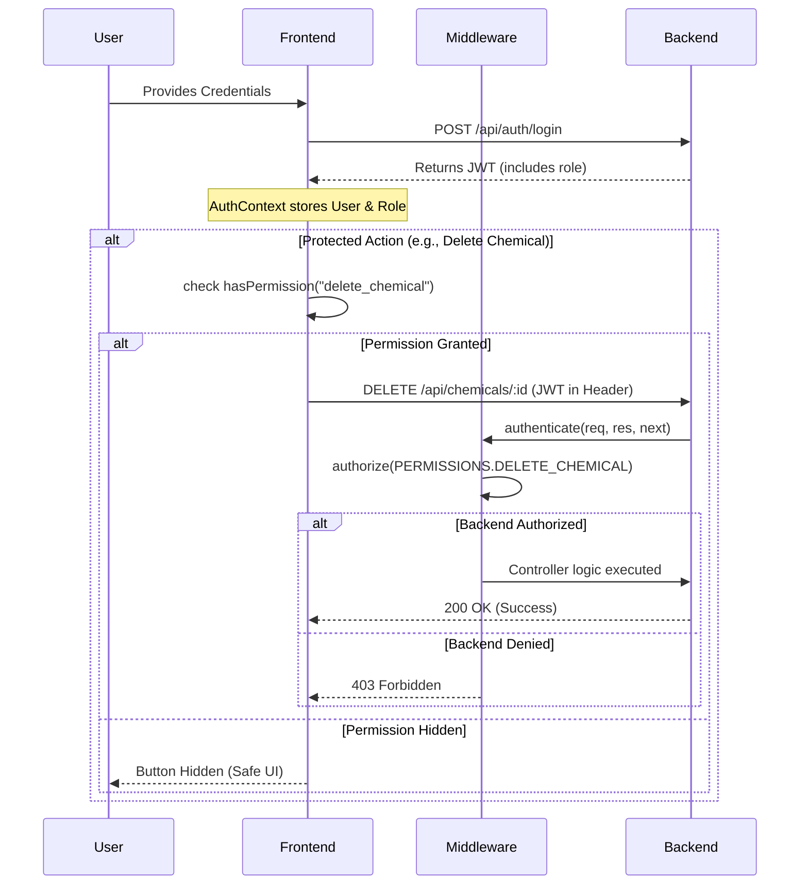

RBAC Implementation Finishing Touches
This plan addresses minor inconsistencies and missing UI-level permission checks to ensure the Role-Based Access Control (RBAC) system is fully aligned across all components.

Proposed Changes
[Frontend Components]
[MODIFY] 
Dashboard.jsx
Update the pending requests API endpoint from /api/inventory/requests to /api/requests to match the backend routing.
[MODIFY] 
ContainerMaster.jsx
Wrap "Add Container", "Edit", and "Delete" buttons with 
hasPermission
 checks.
Roles like Viewer and Safety Officer should not see these action buttons.
[MODIFY] 
BatchMaster.jsx
Wrap "Add Batch", "Edit", and "Delete" buttons with 
hasPermission
 checks.
Ensure only authorized roles can modify batch data.
Verification Plan
Manual Verification
Scenario: Viewer Role
Log in as a user with the Viewer role.
Verify that the "Add", "Edit", and "Delete" buttons are hidden on the Containers and Batches pages.
Verify that the Dashboard correctly fetches "Pending Approvals" (it should be empty/hidden for a Viewer if they don't have approval permissions).
Scenario: Admin Role
Log in as an 
Admin
.
Verify all action buttons are visible and functional.
Confirm the Dashboard correctly displays pending requests.
Scenario: Route Security
Attempt to manually navigate to the /roles page as a Viewer and confirm redirection to the Dashboard.
---

# RBAC System Flow Diagram  

This diagram illustrates how the Chemical Inventory System handles identity and access control, from the initial login to the execution of protected actions.

## Role Hierarchy Summary

| Role | Primary Purpose | Key Permissions |
| :--- | :--- | :--- |
| **Admin** | System Overlord | Full Access, Role Assignment, Audit Logs |
| **Lab Manager** | Operations Lead | Add/Edit Chemical, Approve Requests, Reports |
| **Lab Technician** | Daily Operations | Request Chemicals, Update Stock, Submit Transactions |
| **Safety Officer** | Compliance Monitor | View Hazards, Safety Reports, Audit Logs |
| **Viewer** | Auditor / Guest | Read-only access to inventory and reports |
