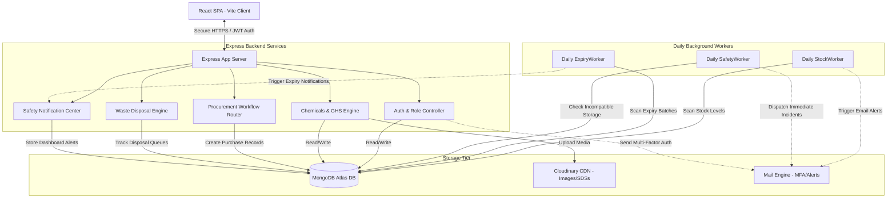

# 🧪 Chemical Inventory & Lab Safety Management System (CIMS PRO)

[](https://chemical-inventory-system-kappa.vercel.app/)
[](https://render.com)
[](https://mongodb.com)

A premium, enterprise-grade full-stack web application designed for multi-laboratory institutions. **CIMS PRO** automates real-time tracking of chemical stocks, container allocations, batch decay/expiration warnings, strict safety compliance sheets, role-based safety alerts, procurement approval funnels, and hazardous waste disposal protocols.

---

## 🗺️ System Architecture



---

## ⚡ Core Feature Showcase

### 📦 Dynamic Volumetric Tracking & Smart Precision
* **Real-Time Level Sensing:** Interactive custom bar charts detailing actual volumetric load metrics across all active storage locations (Block, Room, Cabinet, and Shelf hierarchy).
* **Smart Precision Formatting:** Incorporates a global custom formatting utility (`fmtQty`) preventing precision-rounding issues on micro-volume measurements (like low-dose liquid assets).
* **Location Mapping & Visual Hierarchy:** Constrained responsive bar heights, custom tooltips mapping the full location route on hover, and strict parent boundaries preventing overlapping labels.

### 🛡️ Safety & Strict Compliance (GHS & NFPA)
* **GHS Classifications:** Granular hazard data modeling (Flammable, Explosive, Toxic, Corrosive, Carcinogenic, Biohazard) integrated at vessel enrollment.
* **NFPA 704 Dynamic Fire Diamond:** Custom React component that dynamically parses chemical properties and renders the standard NFPA Hazard Identification diamond (Health, Flammability, Instability, Special Hazards) visually in real-time.
* **Storage Incompatibility Checking:** Core validation guards during scan or transfer operations to proactively prevent the placement of acids beside flammable organic compounds.

### 🔄 Multi-Laboratory Procurement Approval Funnels
* **Request Lifecycle Workflow:** Multi-state workflow transitions (`Pending` ➡️ `Approved`/`Rejected` ➡️ `Ordered` ➡️ `Received`).
* **Financial Ledger Oversight:** Complete tracking of item pricing, quantities, preferred vendor directories, and requesting technician identities.
* **Admin Receipt Binding:** Instant container registration and auto-binding to physical batch tracking upon receiving an approved procurement request.

### ♻️ Safe Hazardous Waste Disposal Management
* **Classified Disposal Requests:** Lab technicians can easily initiate disposal requests with precise container weight, phase state (Liquid, Solid, Gas), and specific laboratory origin.
* **Safety Officer Approval Queue:** Safety Officers inspect chemical logs and approve or reject disposal tickets with recorded, custom compliance reasons.
* **Immutable Compliance Trail:** Retains detailed histories of disposed chemicals, ensuring institutional audit score maintenance.

### ⏰ Daily Background Cron Jobs
* **`StockWorker`:** Evaluates all chemical records daily; automatically triggers safety notifications and email warnings if active stock falls below a chemical's custom threshold.
* **`ExpiryWorker`:** Scans active batches for nearing expiration dates (within 30 days) and updates critical status tags.
* **`SafetyWorker`:** Periodically cross-references location safety matrices for storage code violations.

---

## 🔒 Role-Based Access Control (RBAC) Matrix

CIMS PRO enforces strict role boundaries configured securely in frontend middleware state and validated via JWT verification filters on the backend controllers.

| User Role | Dashboard Actions | Chemical & Container Management | Procurement Approvals | Waste Disposal Approvals | Security Auditing & Logs |
| :--- | :--- | :--- | :--- | :--- | :--- |
| **🛡️ Admin** | Full Admin Command Center | Read/Write (All Labs) | Manage Settings & Lab Silos | Read-Only Audit | Read Immutable Security Logs |
| **🔬 Lab Manager** | View Operational Analytics | Read/Write (Assigned Lab) | Approve/Order Requests | Read-Only | Read Lab Level Activity Logs |
| **🧪 Lab Technician** | Submit Requests & Scan QR | Read/Write (Usage Scan Only) | Submit Purchase Requests | Initiate Waste Disposal Requests | Read Personal Transaction History |
| **📋 Safety Officer** | View Compliance Metrics | Read/Write Safety & GHS | Read-Only Safety Reviews | Inspect & Approve Disposal Queue | Audit Hazard Storage Violations |

---

## 📂 Codebase Repository Map

```text
├── backend/                   # Node.js & Express RESTful API Server
│   ├── src/
│   │   ├── config/            # Cloudinary & MongoDB Connection Setup
│   │   ├── controllers/       # Route request-response logical controllers
│   │   ├── middleware/        # JWT Authentication, Session Guards & RBAC Validation
│   │   ├── models/            # Mongoose Schemas (Chemical, Batch, Procurement, Waste, Logs)
│   │   ├── routes/            # REST API Route declarations mapped to controllers
│   │   ├── workers/           # ExpiryWorker, StockWorker, & SafetyWorker Cron Engines
│   │   ├── app.js             # Central Express initialization & Middleware mapping
│   │   └── server.js          # Core Server Listener (Dynamic port binding)
│   └── package.json           
│
├── frontend/                  # React Vite SPA Client Application
│   ├── src/
│   │   ├── app/               # Main Bootstrapper (main.jsx, App.jsx, global routing)
│   │   ├── components/        # Dynamic UI Elements (NFPA Diamond, Modals, Forms, Alerts)
│   │   ├── context/           # React Global Context (Auth, Notifications, Lab Settings)
│   │   ├── features/          # Component Modules (Procurement, Waste, Scan QR, Batch Masters)
│   │   ├── pages/             # Layout Containers (Dashboard page, Landing Page, Learn More)
│   │   ├── services/          # Central API Axios utility configured with interceptors
│   │   └── styles/            # Responsive CSS Themes, Glassmorphism, & Visual components
│   └── package.json           
│
├── Docs/                      # Legacy Documentation, Analysis PDF, & Compliance logs
└── render.yaml                # Infrastructure-as-code configuration blueprint
```

---

## 🌐 Production API Reference Guide

### 🔑 Authentication & Profiles
* `POST /api/auth/register` - Create user credentials.
* `POST /api/auth/login` - Authenticate user; returns HTTP-only Session Cookie.
* `POST /api/auth/mfa/setup` - Enable Multi-Factor Authentication.
* `GET /api/profile` - Retrieve current user profile context.

### 🧪 Chemical Stock Ledger
* `GET /api/chemicals` - Fetch paginated list of all registered chemical species.
* `GET /api/chemicals/:id` - Fetch comprehensive details including NFPA classification.
* `POST /api/chemicals` - Enroll a new chemical type (Manager/Admin Only).
* `PUT /api/chemicals/:id` - Modify chemical safety parameters.

### 📦 Batches & Vessels
* `GET /api/batches/expiry` - List all nearing-expiration containers.
* `POST /api/batches/scan` - Identify batch metadata via decoded QR string.
* `PUT /api/batches/transfer` - Relocate container between physical storage compartments.

### 🛍️ Procurement System
* `GET /api/procurement` - List department procurement tickets.
* `POST /api/procurement` - Technician initiates new chemical purchase request.
* `PUT /api/procurement/:id/approve` - Manager approves ticket and flags for procurement.
* `PUT /api/procurement/:id/receive` - Mark order as received and automatically ingest containers.

### ♻️ Waste Management
* `GET /api/waste/requests` - Retrieve pending hazardous waste disposal approvals.
* `POST /api/waste/requests` - Initiate chemical vessel disposal.
* `PUT /api/waste/requests/:id/approve` - Safety Officer registers compliance approval.

---

## 🚀 Local Development Quickstart

Follow these instructions to spin up the entire full-stack application on your local machine.

### ⚙️ Prerequisites
* **Node.js:** Ensure `Node >= 18` is installed.
* **MongoDB:** Access to a local MongoDB instance or a MongoDB Atlas connection string.
* **Cloudinary Account:** For uploading chemical profile image assets.

### 📦 Step 1: Environment Settings Configuration
Create a `.env` file inside the `backend` directory mapping your variables:
```env
PORT=5001
HOST=127.0.0.1
MONGODB_URI=your-mongodb-connection-string
JWT_SECRET=your-random-32-character-secret-key
EMAIL_USER=your-institutional-email@gmail.com
EMAIL_PASS=your-secure-app-specific-password
CLOUDINARY_CLOUD_NAME=your-cloudinary-name
CLOUDINARY_API_KEY=your-cloudinary-key
CLOUDINARY_API_SECRET=your-cloudinary-secret
```

Create a `.env` file inside the `frontend` directory containing the API target:
```env
VITE_API_URL=http://localhost:5001
```

### 📡 Step 2: Spin Up the REST API Backend
Open a terminal in the `backend` folder and run:
```bash
npm install
npm run dev
```
The server will boot and successfully bind to `http://localhost:5001`.

### 🖥️ Step 3: Spin Up the React Vite Frontend
Open a separate terminal in the `frontend` folder and run:
```bash
npm install
npm run dev
```
The frontend dev server will start instantly and host your hot-reload view on `http://localhost:5173`. 

Open `http://localhost:5173` in your browser and you are ready to manage your lab stock safely!

---

## 📈 Deployment blueprints

### 🎨 Frontend: Vercel Setup
The frontend is optimized to run as a highly performant Single Page Application (SPA). To prevent client-side routing refreshed links from hitting 404 errors, we deploy with the following **`vercel.json`** rewrite rules:
```json
{
  "rewrites": [
    {
      "source": "/(.*)",
      "destination": "/index.html"
    }
  ]
}
```

### ⚙️ Backend: Render Infrastructure
The backend dynamically binds host listening targets to `process.env.HOST || '0.0.0.0'`, enabling external traffic routing on Render web servers. You can deploy the API service in one click by linking your repository and leveraging our preconfigured root **`render.yaml`** blueprint.
